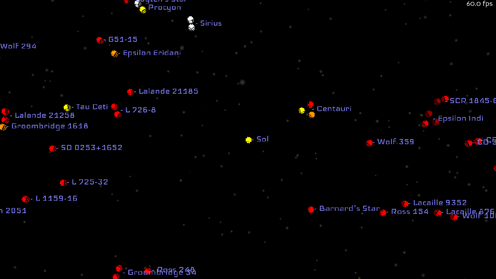
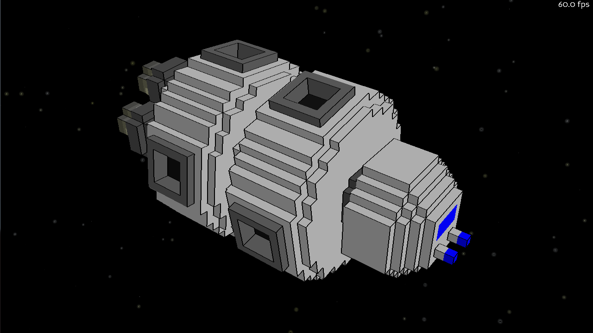

# VoxelEngine
Implements multi-part cartoon-shaded voxel objects (imported form MagicaVoxel format) in Panda3d.

Two demos are included:

starmap.py renders a map of the milky way near earth, and demonstrates the use of shader inputs to color them.

modelview.py renders a sample spaceship with rotating sections and transparent engine flares.

